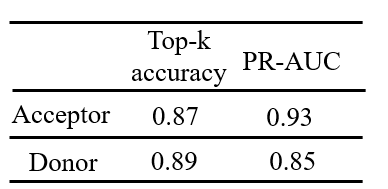

# -预测拟南芥剪切位点的深度残差神经网络
&#8194;&#8194;前段时间分析三代测序数据时得到了一些新的剪切位点，由于Nanopore测序错误率较高，于是我就想结合预测的剪切位点看看测序得到的结果是否可靠。找了一圈没找到能用于拟南芥的剪切位点预测软件，于是仿照  [Jaganathan *et al*, Cell 2019 in press](https://doi.org/10.1016/j.cell.2018.12.015)训练了一个用于拟南芥剪切位点预测的深度残差神经网络。<br></p>
&#8194;&#8194;训练精度如下<br></p>
<div align="left"></div>
模型使用方法：编辑modeluse.py文件<br></p>

```python
from keras.models import load_model
from pkg_resources import resource_filename
from utils2 import one_hot_encode
import numpy as np

input_sequence = 'CGATCTGACGTGGGTGTCATCGCATTATCGATATTGCAT'
#在这里输入你自己的序列
context = 2000
x = one_hot_encode('N'*(context//2) + input_sequence + 'N'*(context//2))[None, :]
model_1 = load_model('./Models/SpliceAI2000_g1.keras')
y1 = model_1.predict(x)
acceptor_prob = y1[0, :, 1]
donor_prob = y1[0, :, 2]

import numpy as np
result = donor_prob[donor_prob > 0.3]
indices = np.where(donor_prob > 0.3)
result1 = acceptor_prob[acceptor_prob > 0.3]
indices1 = np.where(acceptor_prob > 0.3)
print('acceptor_scores:', result1)
print('acceptor_sites:', indices1)
print('donor_scores:', result)
print('donor_sites:', indices)
donor_prob = y[0, :, 2]
```

输入自己的序列然后运行

```python
python modeluse.py
```
即可得到的预测位点及其得分
